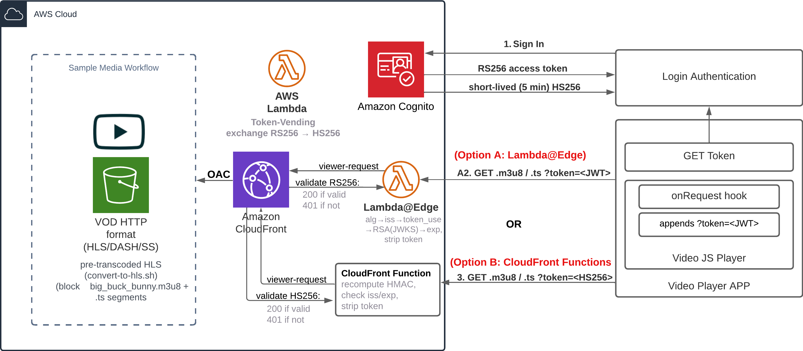

# Architecture

This sample demonstrates **token-gated video streaming**: only authenticated users can
fetch HLS segments from a private S3 bucket, with the authorization decision made at the
CloudFront edge before any byte leaves S3.

All infrastructure is one **AWS CDK app** under [`foundation/`](../foundation), deployed with a
single `cdk deploy`. The [`frontend/`](../frontend) is a pure static React (Vite) app configured at
runtime from the deploy outputs. Everything is pinned to **us-east-1** (Lambda@Edge requirement).

## Components

| Layer | Service | Role |
|-------|---------|------|
| Identity | Amazon Cognito | Authenticates users, issues RS256 JWT access tokens |
| Frontend | React + Video.js (Vite) | Signs the user in, appends a token to each HLS request |
| Edge auth | Lambda@Edge **or** CloudFront Function | Validates the token on `viewer-request`, strips it before origin |
| Token API | API Gateway + Lambda (CFF mode only) | Mints short-lived HS256 tokens for authenticated users |
| CDN | CloudFront | Serves content, enforces HTTPS, caches segments |
| Storage | S3 (private) | Holds HLS manifests + segments; reachable only via CloudFront OAC |



## Token flow (Lambda@Edge mode — default)

1. **Sign in.** The app loads [`runtime-config.json`](../frontend/public/runtime-config.json),
   configures Amplify ([`frontend/src/amplify.js`](../frontend/src/amplify.js)), and signs the user in.
   `fetchAuthSession()` returns the Cognito RS256 access token.
2. **Resolve the stream token.** [`frontend/src/auth/streamToken.js`](../frontend/src/auth/streamToken.js)
   returns the Cognito access token as-is in this mode.
3. **Attach token.** `videojs.Vhs.xhr.beforeRequest`
   ([`frontend/src/components/player/VideoPlayer.jsx`](../frontend/src/components/player/VideoPlayer.jsx))
   appends `?token=<jwt>` to every manifest/segment request.
4. **Validate at edge.** The Lambda@Edge handler
   ([`foundation/edge/lambda-edge/jwt-auth/index.js`](../foundation/edge/lambda-edge/jwt-auth/index.js))
   runs on `viewer-request` and:
   - checks the JWT has 3 parts and `alg === RS256` (rejects algorithm confusion),
   - validates `iss`, `token_use === "access"`, and `exp`,
   - verifies the RS256 signature against the Cognito JWKS using native `crypto`,
   - **strips the token from the query string** so it never reaches (or is cached by) S3.
5. **Serve.** CloudFront fetches from S3 via Origin Access Control (SigV4); the bucket policy
   only trusts this distribution.

For the **CloudFront Functions** mode flow (HS256 tokens, token-vending API), see
[EDGE-AUTH-MODES.md](EDGE-AUTH-MODES.md).

## Why these choices

- **Pure CDK, single deploy.** One `cdk deploy` provisions Cognito, S3, CloudFront, the edge
  validator, and (in CFF mode) the token API. No Amplify CLI, no double-push, no imperative
  post-deploy hook — the edge association is native to the L2 `Distribution` construct.
- **JWKS fetched at runtime, not baked.** Because CDK *creates* the Cognito pool, the JWKS isn't
  known at synth time. The Lambda@Edge validator fetches the JWKS on cold start, caches it by `kid`,
  and refreshes on an unknown `kid` — so **Cognito key rotation needs no redeploy**. The pool ID is
  supplied via SSM Parameter Store (Lambda@Edge can't use environment variables).
- **Native `crypto`** in the validator: zero runtime dependencies — smaller, faster cold starts,
  fewer CVEs to track.
- **OAC (not legacy OAI):** SigV4 origin signing, the current AWS-recommended pattern; the
  distribution-scoped bucket policy is created automatically.
- **Security-first token API (CFF mode):** the token-vending endpoint is **not public** — it sits
  behind API Gateway with a Cognito authorizer (no Lambda Function URLs). See
  [EDGE-AUTH-MODES.md](EDGE-AUTH-MODES.md).

## Known limitations

The token travels in the **query string** (`?token=`), so it can appear in access logs. The edge
strips it before the origin, but a production system handling long-lived content might prefer signed
cookies or per-segment signed URLs. The CFF mode mitigates exposure by using short-lived (5-minute)
tokens that the frontend auto-refreshes.

## Repository layout

```
foundation/                          The CDK app (run cdk / npm run deploy here)
  bin/foundation.ts                  App entry; reads -c authMode, wires stacks
  lib/
    auth-stack.ts                    Cognito user pool + client
    media-stack.ts                   S3 + CloudFront + edge validator + (CFF) token API
    constructs/
      secure-distribution.ts         L2 Distribution + OAC; mode-conditional edge association
      token-vending-api.ts           API Gateway + Cognito authorizer + Lambda (CFF mode)
  edge/
    lambda-edge/jwt-auth/            RS256 validator (runtime JWKS, native crypto)
    cloudfront-function/jwt-auth.js  HS256 validator (reads HMAC secret from KeyValueStore)
  lambda/
    token-vending/                   Mints HS256 tokens for authenticated users
    kvs-populate/                    Custom resource: copies HMAC secret into the KeyValueStore
  assets/demo/hls/                   Demo HLS video (uploaded to S3 by the stack)
  scripts/
    convert-to-hls.sh                Re-encode a source video to the demo HLS asset
    write-frontend-config.mjs        Maps cdk outputs -> frontend/public/runtime-config.json
frontend/                            Pure static React (Vite)
  src/
    config/runtimeConfig.js          Fetches /runtime-config.json at startup
    amplify.js                       Configures Amplify from runtime config
    auth/streamToken.js              Resolves the stream token per auth mode
    components/                      App, Home, VideoPlayer, DiagnosticsPanel, ...
  public/runtime-config.json         Generated by the deploy (placeholder committed)
docs/                                Architecture, edge-auth modes, images
```
